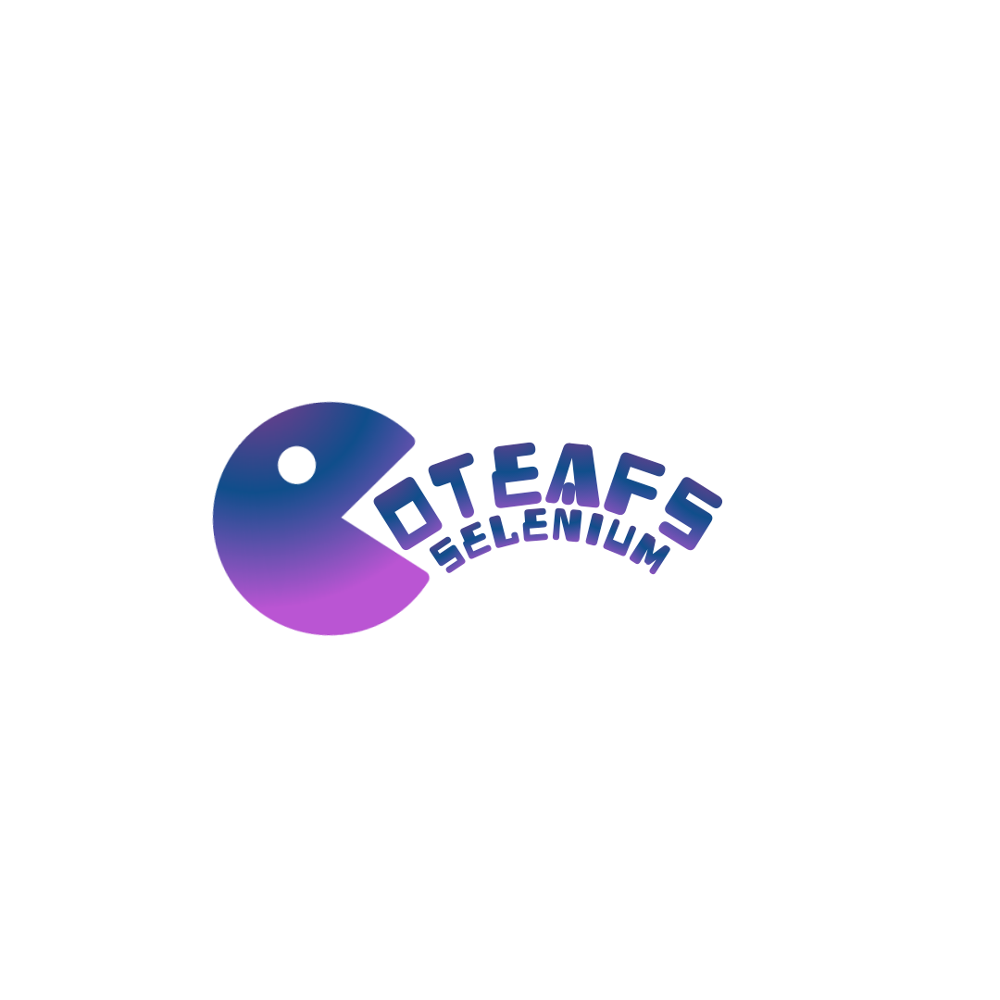

<p align="center">
  <a href="">
    
  </a>
</p>

<h1 align="center">Selenium WebDriver wrapper Framework in Java, which supports Automation of most of the web browsers.</h1>

[][](https://app.fossa.io/projects/git%2Bgithub.com%2FWasiqB%2Fcoteafs-selenium?ref=badge_shield)
[home]
[](https://gitter.im/WasiqB/coteafs-selenium?utm_source=badge&utm_medium=badge&utm_campaign=pr-badge)
[][circleci]
[][coverage]
[](https://sonarcloud.io/dashboard?id=com.github.wasiqb.coteafs%3Aselenium)
[](https://sonarcloud.io/component_measures?id=com.github.wasiqb.coteafs%3Aselenium&metric=Maintainability)
[](https://sonarcloud.io/component_measures?id=com.github.wasiqb.coteafs%3Aselenium&metric=Reliability)
[](https://sonarcloud.io/component_measures?id=com.github.wasiqb.coteafs%3Aselenium&metric=Security)
[](https://sonarcloud.io/component_measures?id=com.github.wasiqb.coteafs%3Aselenium&metric=new_vulnerabilities)
[](https://sonarcloud.io/component_measures?id=com.github.wasiqb.coteafs%3Aselenium&metric=Duplications)
[][maven]
[](https://github.com/WasiqB/coteafs-selenium/releases)
[](https://opensource.org/licenses/Apache-2.0)

> **Detailed documentation on main project site is under development.**

## :question: What is this Framework about?

This is a Selenium WebDriver wrapper Framework which enables robust, maintainable and easy to write test scripts. _**It supports latest stable Selenium WebDriver 3.141.59**_.

## :bulb: What features does this framework offer?

Some of the key features which this framework offers are as follows:

:point_right: Latest stable Selenium WebDriver 3.141.59.

:point_right: Minimal learning curve.

:point_right: Supports Chrome, Safari, Firefox, IE and Edge

:point_right: Supports execution on BrowserStack, SauceLabs and Selenium Grid.

:point_right: On-demand highlighting of Elements.

:point_right: On-demand video recording and screenshots.

:point_right: On-demand delay of test execution by allowing predefined delays.

:point_right: On-demand headless mode execution for Chrome and Firefox.

:point_right: Inline verification of elements.

:point_right: Supports logging of events to Log file.

:point_right: Supports all major test frameworks like TestNG, JUnit, Cucumber, etc.

:point_right: Parallel execution of tests on different browsers.

## :pushpin: Usage?

You can use the following dependency into your `pom.xml` to use this library.

```xml
<dependency>
  <groupId>com.github.wasiqb.coteafs</groupId>
  <artifactId>selenium</artifactId>
  <version>3.2.0</version>
</dependency>
```

Or you can add the following into your `build.gradle` file.

 ```gradle
 compile "com.github.wasiqb.coteafs:selenium:3.2.0"
 ```

## :smile: How it is easy to write Tests with this Framework?

Getting hands-on with this framework requires minimal time. You can start writing tests in following 4 simple steps.

<details>
  <summary><strong>1. :wrench: Create Config file</strong></summary>
  <br/>

Config file is by default searched in `src/test/resources` folder. The name of the config file is by default considered as `selenium-config.yaml`. But the same can be overridden by using System property `coteafs.selenium.config` where you can specify the new config file for the test.

#### Sample Config file

`src/test/resources/selenium-config.yaml`

```yaml
browser: CHROME           # CHROME, SAFARI, EDGE, FIREFOX, IE.
url: http://demo.guru99.com/V4/   # Application URL.
headless_mode: false      # true, for headless, else false.
driver:                   # Driver manager specific settings.
  force_cache: true       # true, false (default). Forces to use cached driver.
  force_download: true    # true, false (default). Forces to download driver each time.
  path: /drivers/         # Local path where drivers will searched for.
  version: 2.14           # Version of driver.
  exe_url: https://driver/download/url    # Driver download URL.
remote:                   # Remote settings block (required when Browser is Remote).
  user_id: ${CLOUD_USER}  # Cloud User. Not required for Grid.
  password: ${CLOUD_KEY}  # Cloud Key. Not required for Grid.
  protocol: HTTPS         # HTTP, HTTPS. Default HTTP.
  url: hub-cloud.browserstack.com   # Remote hub URL
  source: BROWSERSTACK    # BROWSERSTACK, GRID, SAUCELABS
  capabilities:           # Remote capabilities.
    browser: Chrome
    browser_version: 75.0
    os: Windows
    os_version: 10
    resolution: 1024x768
    name: Any Test name
  cloud_capabilities:     # Cloud specific capabilities.
    seleniumVersion: 3.141.59
    name: Sauce-[Java] Sample Test
params:     # test specific map.
  user: <test-specific-user>
  password: <test-specific-password>
playback:   # Playback settings.
  screen_state: NORMAL  # FULL_SCREEN, MAXIMIZED, NORMAL
  highlight: true       # true, to highlight elements, else false.
  screen_resolution:    # Screen resolution settings.
    width: 1280     # Screen width.
    height: 768     # Screen height.
  recording:
    enable: true    # true, to enable recording, else false.
    path: ./video   # Video recording path.
    prefix: VID     # Video file prefix.
  delays:       # On demand delay settings.
    implicit: 60          # Implicit waits in seconds.
    explicit: 60          # Explicit waits in seconds.
    after_frame_switch: 500   # Delay after iFrame switch in milliseconds.
    after_window_switch: 500  # Delay after Window switch in milliseconds.
    before_key_press: 0   # delay before key press in milliseconds.
    after_key_press: 0    # delay after key press in milliseconds.
    before_mouse_move: 0  # delay before mouse move in milliseconds.
    after_mouse_move: 0   # delay after mouse move in milliseconds.
    before_click: 0       # delay before mouse click in milliseconds.
    after_click: 0        # delay after mouse click in milliseconds.
    page_load: 60         # page load timeout in seconds.
    script_load: 60       # script load timeout in seconds.
    highlight: 500        # highlight delay in milliseconds.
  screenshot:     # Screenshot settings.
    path: ~/screenshots     # default screenshot path.
    prefix: SCR             # screenshot file prefix.
    extension: jpeg         # screenshot file extension.
    capture_on_error: false # screenshot on error.
    capture_all: true       # always capture screenshot on each event, when true.
```

> **Note:** If you find any config not working, feel free to raise an [issue][].

</details>

<details>
  <summary><strong>2. :page_facing_up: Create Page object class</strong></summary>
  <br/>

Checkout the following examples which will guide you in writing tests. Lets have a look at the Login page of Guru99 demo site.

> Remember, `BrowserPage` class needs to be extended for every page and also a flavour of inheritance can be added as per requirement.

#### Sample Page object

```java
package com.github.wasiqb.coteafs.selenium.pages;

import org.openqa.selenium.By;

import com.github.wasiqb.coteafs.selenium.core.BrowserPage;
import com.github.wasiqb.coteafs.selenium.core.element.IMouseActions;
import com.github.wasiqb.coteafs.selenium.core.element.ITextboxActions;

public class LoginPage extends BrowserPage {
  public ITextboxActions password () {
    return form ().find (By.name ("password"), "Password");
  }

  public IMouseActions signIn () {
    return form ().find (By.name ("btnLogin"), "Login");
  }

  public ITextboxActions userId () {
    return form ().find (By.name ("uid"), "User ID");
  }

  private IMouseActions form () {
    return onClickable (By.name ("frmLogin"), "Form");
  }
}
```

</details>

<details>
  <summary><strong>3. :runner: Create Page Action class</strong></summary>
  <br/>

This is a new concept, here you can define actions specific to each page. This approach abstracts out the page action flows and helps in modularising the classes. So whenever the flow of the page changes, you need to change only at single place.

> For every page action you need to extend `AbstractPageAction`. Since it is a generic class, you need to pass the action class name as it's generic type.
> Also, `perform` method needs to be implemented for every action class.

#### Sample page action

```java
package com.github.wasiqb.coteafs.selenium.pages.action;

import static java.text.MessageFormat.format;

import com.github.wasiqb.coteafs.selenium.core.page.AbstractPageAction;
import com.github.wasiqb.coteafs.selenium.pages.LoginPage;
import com.github.wasiqb.coteafs.selenium.pages.MainPage;

public class LoginPageAction extends AbstractPageAction <LoginPageAction> {
  public static final String PASS    = "password";
  public static final String USER_ID = "userId";

  @Override
  public void perform () {
    final LoginPage login = new LoginPage ();
    login.userId ()
      .enterText (value (USER_ID));
    login.password ()
      .enterText (value (PASS));
    login.signIn ()
      .click ();

    login.nextPage (MainPage.class)
      .managerIdBanner ()
      .verifyText ()
      .endsWith (format ("Manger Id : {0}", value (USER_ID).toString ()));
  }
}
```

</details>

<details>
  <summary><strong>4. :white_check_mark: Write Test class</strong></summary>
  <br/>

Test which are written using this framework are slightly different than usual. In the tests, Page actions is used instead of page objects. This can be demonstrated as shown below:

#### Sample Test

> Every test class extends `BrowserTest` class.

```java
package com.github.wasiqb.coteafs.selenium;

import static com.github.wasiqb.coteafs.selenium.config.ConfigUtil.appSetting;
import static com.github.wasiqb.coteafs.selenium.pages.action.LoginPageAction.PASS;
import static com.github.wasiqb.coteafs.selenium.pages.action.LoginPageAction.USER_ID;

import org.testng.annotations.BeforeClass;
import org.testng.annotations.Test;

import com.github.wasiqb.coteafs.selenium.core.BrowserTest;
import com.github.wasiqb.coteafs.selenium.pages.MainPage;
import com.github.wasiqb.coteafs.selenium.pages.action.LoginPageAction;

public class SeleniumTest extends BrowserTest {
  @BeforeClass
  public void setupMethod () {
    final MainPage main = new MainPage ();
    main.onDriver ()
      .navigateTo (appSetting ().getUrl ());
  }

  @Test
  public void testSignIn () {
    final LoginPageAction login = new LoginPageAction ();
    login.addInputValue (USER_ID, appSetting ().getParams ()
      .get ("user"))
      .addInputValue (PASS, appSetting ().getParams ()
      .get ("password"))
      .perform ();
  }
}
```

</details>

<details>
  <summary><strong>5. :microscope: Create TestNG XML file</strong></summary>
  <br/>

### Basic syncronous run

Following is a simple `testng.xml` file for running the tests on Chrome browser **locally, on grid and on BrowserStack** in sync.

```xml
<?xml version="1.0" encoding="UTF-8"?>
<!DOCTYPE suite SYSTEM "http://testng.org/testng-1.0.dtd">
<suite name="Suite">
  <listeners>
    <listener class-name="com.github.wasiqb.coteafs.listeners.ConfigListener"/>
    <listener class-name="com.github.wasiqb.coteafs.listeners.SuiteListener"/>
    <listener class-name="com.github.wasiqb.coteafs.listeners.TestListener"/>
    <listener class-name="com.github.wasiqb.coteafs.listeners.ExecutionListener"/>
    <listener class-name="com.github.wasiqb.coteafs.listeners.DataProviderListener"/>
    <listener class-name="com.github.wasiqb.coteafs.listeners.AnnotationTransformer"/>
  </listeners>
  <test name="Test Local">
    <classes>
      <class name="com.github.wasiqb.coteafs.selenium.SeleniumTest">
        <methods>
          <include name="testSignIn"/>
          <include name="testNewCustomer"/>
          <include name="testEditCustomer"/>
          <include name="testNewAccount"/>
          <include name="testDeleteAccount"/>
          <include name="testDeleteCustomer"/>
        </methods>
      </class>
    </classes>
  </test>
  <test name="Test Grid">
    <parameter name="test.browser" value="REMOTE"/>
    <parameter name="test.config" value="./src/test/resources/selenium-grid-config.yaml"/>
    <classes>
      <class name="com.github.wasiqb.coteafs.selenium.SeleniumTest">
        <methods>
          <include name="testSignIn"/>
        </methods>
      </class>
    </classes>
  </test>
  <test name="Test BrowserStack">
    <parameter name="test.browser" value="REMOTE"/>
    <parameter name="test.config" value="./src/test/resources/selenium-bs-config.yaml"/>
    <classes>
      <class name="com.github.wasiqb.coteafs.selenium.SeleniumTest">
        <methods>
          <include name="testSignIn"/>
        </methods>
      </class>
    </classes>
  </test>
</suite>
```

> **Note:** Notice the parameter used in last 2 tests,
- `test.browser`: You can override the browser set in config file, it accepts same value as described in confid section.
- `test.config`: You can set different config for current test.

### Parallel Run

In case you want to run tests for different browsers parallely, you just need to modify the following line in `testng.xml`.

```xml
. . .
<suite name="Suite" parallel="tests" thread-count="10">
. . .
```

This attributes will tell testng to run all the test blocks in 10 parallel threads.

</details>

<details>
  <summary><strong>6. :cyclone: Running TestNG XML file</strong></summary>
  <br/>

### Running on local browsers or on Selenium Grid

Run the tests using following command,

```bash
$ mvn clean install -Dsuite-xml=testng.xml
```

### Running on BrowserStack or any other cloud solution

Run the tests using following command,

```bash
$ mvn clean install -Dsuite-xml=testng.xml -DCLOUD_USER=<cloud_user> -DCLOUD_KEY=<cloud_key>
```

</details>

## :question: Need Assistance?

- You can chat with us on our [Gitter][gitter] room.
- Directly chat with me on my [site][] and I'll revert to you as soon as possible.
- Discuss your queries by writing to me @ [wasbhamla2005@gmail.com][mail]
- If you find any issue which is bottleneck for you, [search the issue tracker][tracker] to see if it is already raised.
- If not raised, then you can create a [new issue][issue] with required details as mentioned in the issue template.

## :star2: What you do if you like the project?

- Spread the word with your network.
- **Star** the project to make the project popular.
- Stay updated with the project progress by **Watching** it.
- **Contribute** to fix open issues, documentations or add new features. To know more, see our [contributing][] page.
- I would be delighted if you can **Sponsor** this project and provide your support to open source development by clicking on the Sponsor button on the top of this repository.

## :gift_heart: Thanks for the support.

<p align="left">
  <a href="http://browserstack.com">
    
  </a>
</p>

For allowing us to run our unit tests on different cloud platforms.

## :white_check_mark: Contributors

<div>
  <ul>
    <li>
      <a href="https://github.com/WasiqB">
        
      </a>
    </li>
    <li>
      <a href="https://github.com/mfaisalkhatri">
        
      </a>
    </li>
    <li>
      <a href="https://github.com/jayeshd7">
        
      </a>
    </li>
  </ul>
</div>

## :ticket: Versioning ideology

<p align="left">
  <a href="http://semver.org/">
    
  </a>
</p>

## :copyright: Wasiq Bhamla

<p align="left">
  <a href="http://www.apache.org/licenses/LICENSE-2.0">
    
  </a>
</p>

[gitter]: https://gitter.im/WasiqB/coteafs-selenium
[home]: https://github.com/wasiqb/coteafs-selenium
[circleci]: https://circleci.com/gh/WasiqB/coteafs-selenium
[coverage]: https://sonarcloud.io/component_measures?id=com.github.wasiqb.coteafs%3Aselenium&metric=Coverage
[maven]: https://maven-badges.herokuapp.com/maven-central/com.github.wasiqb.coteafs/selenium
[site]: https://wasiqb.github.io
[tracker]: https://github.com/WasiqB/coteafs-selenium/issues?q=something
[issue]: https://github.com/WasiqB/coteafs-selenium/issues/new
[contributing]: .github/CONTRIBUTING.md
[mail]: mailto:wasbhamla2005@gmail.com


[](https://app.fossa.io/projects/git%2Bgithub.com%2FWasiqB%2Fcoteafs-selenium?ref=badge_large)